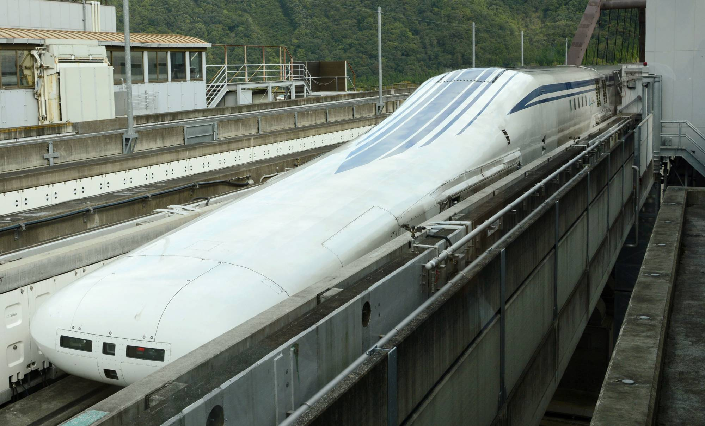

Kelmarin masa random2 buka tv tertengok satu konten rancangan menarik yg buat saye rasa nak share. Video saya sertakan dalam post ini sekali ( translation tak rajin nak buat so siapa yg bleh nihonggo silakan ). 
.

actually masa belajar tahun 2013 lagi dah dengar2 diorg ada test run dekat yamanashi track tu tapi masa tu tak de la betul2 minat nak search. Tahu2 bila tertengok balik channel ni, baru tahu train tu da dekat nak deploy to public use. Terkezut jap. (Pembetulan, official opening dijangkakan 2027, tapi untuk orang awam boleh pergi experience dekat track khas adalah dijangkakan tahun ini.
.

Sedikit trivia tentang Maglev ni. Teknologi yg digunakan untuk train ini agak berbeza dengan "conventional" train dimana train jenis ini menggunakan "electromagnetic propulsion". (magnetic levitation) untuk bergerak. Basically terapung di atas railway disebabkan oleh daya tolak magnet yang dihasilkan oleh superconductor.
.

Apa benefit maglev ni? Pertama, bila kereta ni terapung di atas landasan, means less vibration (lebih selesa) dan less friction (kurang maintainance cost disebabkan wear and tear). 

Kelajuan maksimum dalam 500 kilometer per jam. 2 kali ganda dari  konsep ni sama dengan yg elon musk nk pakai untuk hyperloop. Merujuk pada video tu, apabila mencapai lebih kurang kelajuan 150kph, baru akan mode train ni akan bertukar dari mode menggunakan tayar kepada mode maglev ni. 

Research tentang maglev ni telah ongoing sejak dari tahun 70an lagi. Cuba bayangkan berapa banyak duit yg dah dipam untuk RnD sahaja. Memang tak dinafikan bukan perkara yg mudah, average hidup manusia, nak kata kerja2 RnD ni bukan mudah, ambil masa, dan perlukan kepakaran dan sumber yg sangat banyak. Tapi bila tapi nak stay competitive among the giants, ini adalah contoh ciri2 producing nations yg kita dapat ambil. 

### Referensi
- [How Maglev Works | Department of Energy](https://www.energy.gov/articles/how-maglev-works)
- [Maglev Train](https://science.howstuffworks.com/transport/engines-equipment/maglev-train.htm)
