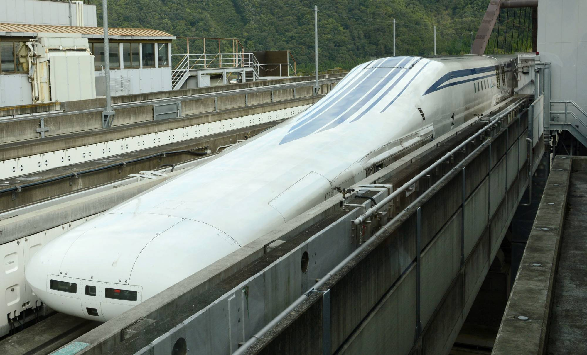
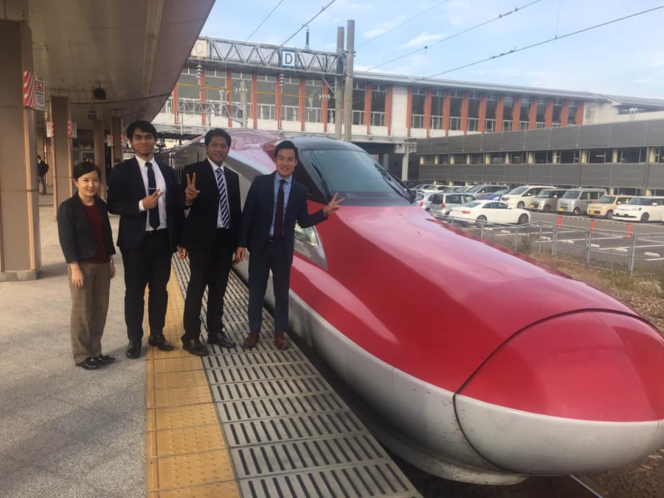
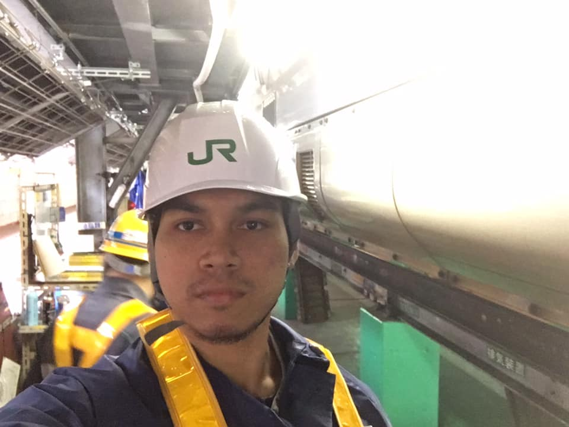

KERETA TERBANG JEPUN "Maglev" 
-------------------------------------
Kelmarin masa random2 buka tv tertengok satu konten rancangan menarik yg buat saya rasa nak share. Video saya sertakan dalam post ini sekali ( translation tak rajin nak buat so siapa yg bleh nihonggo silakan 🙂 ). 

Actually masa belajar tahun 2013 lagi dah dengar2 diorg ada test run dekat yamanashi track tu tapi masa tu tak de la betul2 minat nak search. Tahu2 bila tertengok balik channel ni, baru tahu train tu bakal dibuka untuk public naik dan test power. Terkezut jap.

## Sedikit trivia tentang Maglev. 

Teknologi yg dipakai untuk train ini berbeza dengan conventional train dimana train jenis ini menggunakan "magnet"  untuk bergerak. Tapi bukan magnet biasa-biasa. Magnet yg dipakai ni merupakan"superconductor magnet". Oleh sebab tu namanya dipanggil maglev. Singkatan kepada "magnetic levitation". 
Macam mana ia berfungsi?

Secara ringkas, daya tolak magnet yang terhasil tersebut membolehkan ia terapung dan "terbang" untuk maju ke depan. Ini baru betul kereta terbang. haha.

 Taknak sembang panjang tentang detail teknologi yg dipakai tapi untuk sesiapa yg berminat bleh di rujuk di link ini [How Maglev Trains Work | HowStuffWorks](https://science.howstuffworks.com/.../maglev-train.htm).

## Berapa laju boleh pergi?

Kelajuan maksimum train ni boleh mencecah dalam 600 kilometer per jam. Dua kali ganda lebih laju dari shinkansen sekarang. Perjalanan dari tokyo ke osaka yg sekarang ambil masa lebih kurang 90 minit bakal dipendekkan menjadi 40 minit. Fuh berdesup. 

## Berapa lama makan masa nak develop?

Research tentang maglev ni telah ongoing sejak dari tahun 70an lagi. Maksudnya, da nak dekat 50 tahun projek ni berjalan. Pergh. Bayangkan berapa banyak duit yg dah dipam untuk realize kan maglev ni. 

## Apa yg kita boleh belajar dari sini?

Ini contoh sifat "producer nation" yang kita boleh tiru tanpa segan silu. Mereka mostly ada mindset untuk fikir long term vision, macam mana negara mampu nak bersaing di peringkat dunia. 50 tahun bukan jangka waktu yg pendek tapi jika itu yg diperlukan untuk memastikan negara kekal kompetitif then be it. Leaders need to take that responsibility and make the call even its super tough.

Sekian perkongsian pendek dari saya.

## Referensi
- [How Maglev Trains Work | HowStuffWorks](https://science.howstuffworks.com/.../maglev-train.htm).
- [How Maglev Works | Department of Energy](https://www.energy.gov/articles/how-maglev-works)